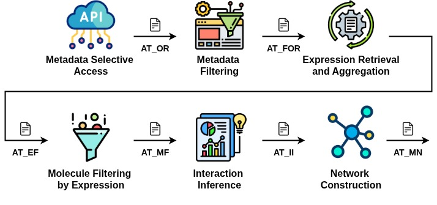

# Notebooks

This folder contains the Jupyter Notebooks that represent each stage of the pipeline:

- `01_metadata-selective-access.ipynb`
- `02_metadata-filtering.ipynb`  
- `03_expression-retrieval-and-aggregation.ipynb`
- `04_molecule-filtering-by-expression.ipynb`
- `05_interaction-inference.ipynb`
- `06_network-construction.ipynb`

## Recommended Usage

Run the notebooks in order from 01 to 06

## Requirements

- Python packages: see `requirements.txt`
- R packages: see the main README
